# IMC Prosperity 3 Documentation

Welcome to the **IMC Prosperity 3 Documentation**, which outlines our strategies and insights developed during the 15-day algorithmic trading competition organized by IMC. This repository contains details of our strategies. For the full documentation, please visit
```
IMC_Prosperity_3_Documentation.pdf
```

## 👥 Team "Ding Crab"
- **Angus Cheung**  
  - LinkedIn: [Angus Cheung](https://www.linkedin.com/in/anguscheung)  
  - GitHub: [angus4718](https://github.com/angus4718)  
  
- **Vincent Cheng**  
  - LinkedIn: [Vincent Cheng](https://www.linkedin.com/in/vincent-chengkc)  
  - GitHub: [Raunald](https://github.com/Raunald)  

**Team Rankings**:
- Algorithmic Trading: **28th**
- Overall: **44th**

---

## 🛠️ Rounds and Strategies
<details>
<summary><h2>Round 1: Market Making</h2></summary>

Round 1 introduced three products - Rainforest Resin, Kelp, and Squid Ink.

**Rainforest Resin**

Rainforest Resin is the simplest product in the competition. Its fair value is permanently fixed at 10,000 SeaShells. As observed from the figures below, bots quote bid and ask prices around the fair price with a very wide spread.

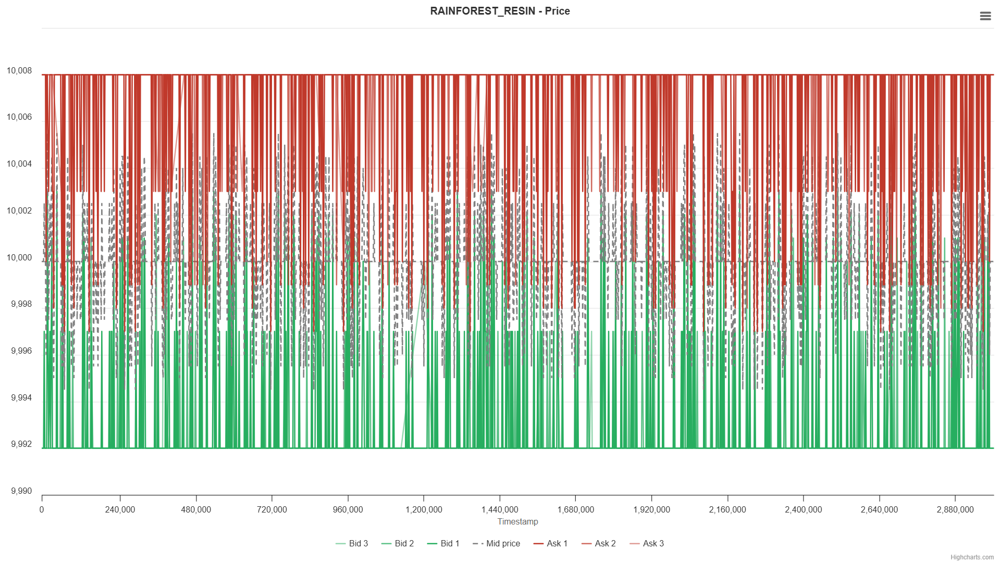
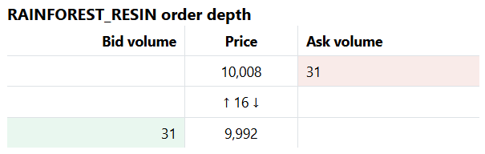

The first trade idea from a market-taking perspective is to buy whenever the ask crosses below 10,000 and sell whenever the bid crosses above 10,000.

Although this strategy almost guarantees profit, this setup happens too infrequently to make enough profit. Another trade idea is to make market by submitting bid and ask orders based on the current order book. We place a bid at one seashell above the current market bid, and an ask at one seashell below the current market ask. In the meantime, we make sure that our bid must be less than or equal to 9,999 SeaShells, and our ask must be greater than or equal to 10,001 SeaShells.

Lastly, we also realize that some trading opportunities may not be captured if our position is stuck at the limit. Therefore, before we implement the market-making strategy, we have an additional step to offload excessive inventory at the fair price. This brings our position closer to zero whenever possible and allow us to capture more trading opportunities.

This concludes the three-step strategy for Rainforest Resin. We start with the market taking algorithm to trade on deviations from the fair price, then offload excessive inventory at the fair price if possible, and lastly quoting bid and ask orders in the market.

**Kelp**

Kelp's price moves around but remains relatively stable. As seen from the figures below, the bid-ask spread is much tighter for Kelp, but there are no extreme spikes in the price movements. Therefore, we settled on some metrics based on the current order book to estimate Kelp's fair price. We also noticed that there are often small-volume orders before the popular bid and popular ask prices. We define the popular bid/ask price as the bid/ask price with the highest volume. As a result, when we estimate the fair price for Kelp, we use the popular mid, which better reflects the consensus price levels in the market.
\[
\text{Popular Mid Price} = \dfrac{\text{Popular Bid Price} + \text{Popular Ask Price}}{2}
\]

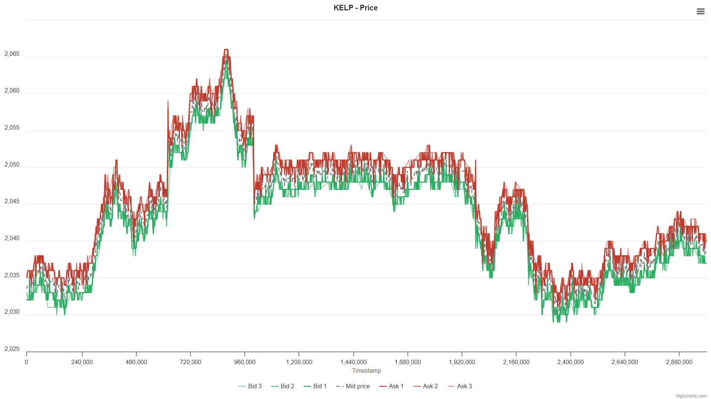
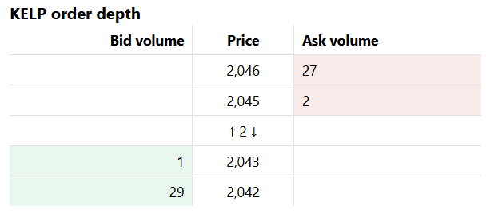

Other than the fair price determination, the strategy for Kelp is similar to that of Rainforest Resin.

**Squid Ink**

Squid Ink is much more volatile than the other two products mentioned above. From the figures, there are occasional extreme spikes in the price followed by a rapid reversal. The bid-ask spread is tighter. Combined with the volatile prices, this leaves less room for profitable market making.

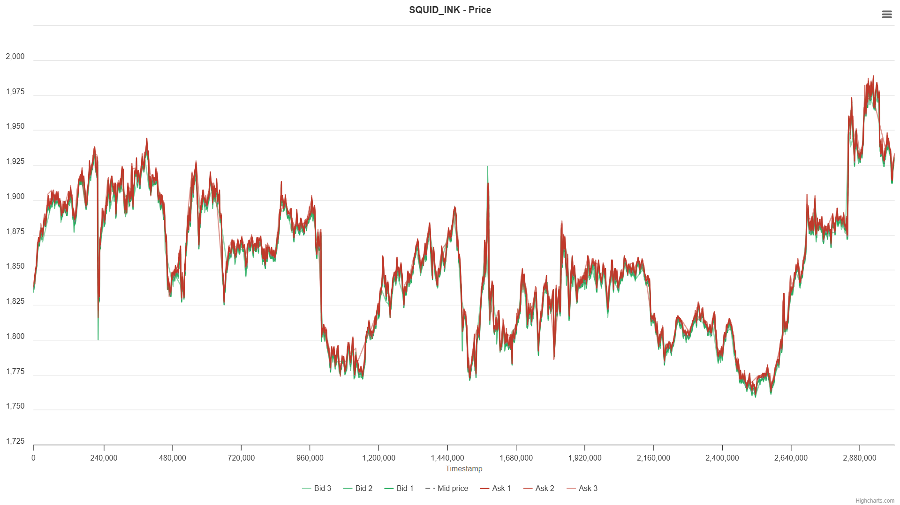
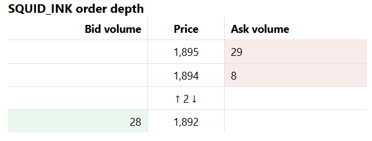

To capture this mean-reversion behavior, we implemented a mean reversion trading strategy on a rolling window.
</details>

---
<details>
<summary><h2>Round 2: Index Arbitrage</h2></summary>

Round 2 introduced two picnic baskets. Picnic Basket 1 contains six Croissants, three Jams, and One Djembe, while Picnic Basket 2 contains four Croissants and two Jams. Additionally, participants can trade the underlying products individually.

The obvious strategy here is to trade on the deviation between the baskets' prices and the synthetic baskets' prices calculated from the underlyings' prices.

We initially tried pair trading strategies between the actual baskets and the synthetic baskets. However, some issues arose.

Firstly, the position limits on the individual underlyings are too little. Either we reduce the positions on the baskets to fully hedge our positions, which causes unused capacity for the baskets, or we fully utilize the position limits on the baskets, which causes our positions to be partially unhedged. Moreover, in backtesting, we realized that our profit is mostly contributed by the baskets, and our positions in the underlyings are always losing. Therefore, we decided to use the spreads as a signal to long/ short the baskets, but not to trade the underlyings.
</details>

---
<details>
<summary><h2>Round 2: Options Trading</h2></summary>

Round 3 introduced Volcanic Rocks and five Volcanic Rock Vouchers at strike prices 9,500, 9,750, 10,000, 10,250, and 10,500. The vouchers will give the holder the right but not obligation to buy a Volcanic Rock at the strike price at the expiry timestamp. At beginning of Round 1, all the Vouchers have 7 trading days to expire. By end of Round 5, vouchers will have 2 trading days left to expire.

We generate two volatility smiles for the bid and ask prices respectively using the Black-Scholes model.

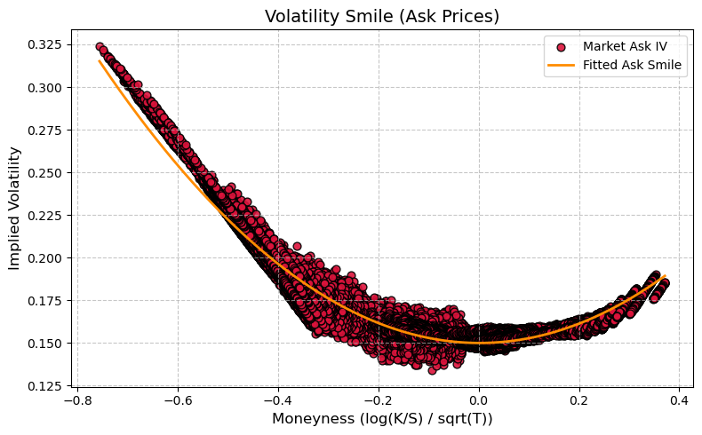
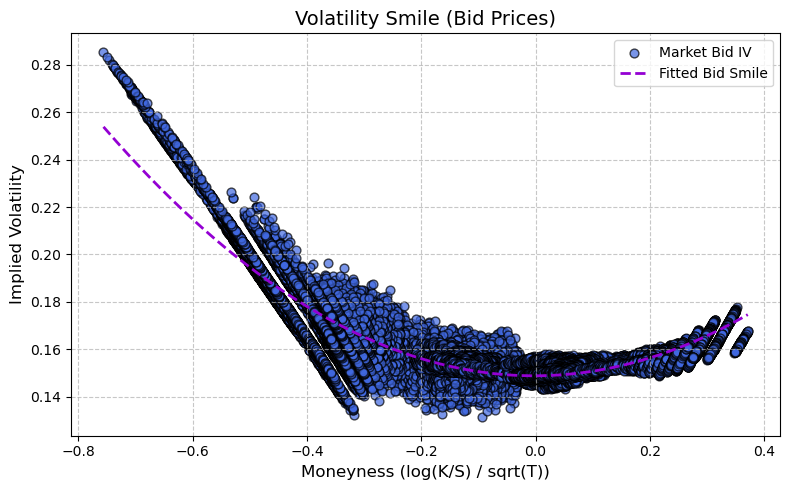
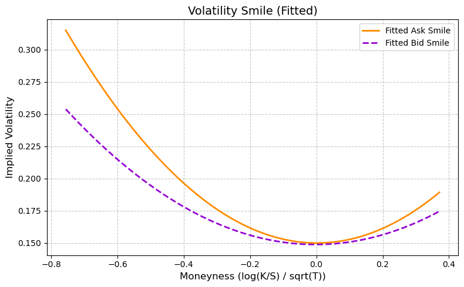

We use the fitted parameters below for our trading strategy:

- **Model coefficients for ASK:**
  - \( a \) (quadratic term): 0.2878490683651303  
  - \( b \) (linear term): -0.0009201058370376721  
  - \( c \) (intercept): 0.1499510693474374  

- **Model coefficients for BID:**
  - \( a \) (quadratic term): 0.1850111314490967  
  - \( b \) (linear term): 0.0008529599232086579  
  - \( c \) (intercept): 0.14879176125529844
</details>

---
<details>
<summary><h2>Round 4: Factor Trading</h2></summary>
Round 4 introduced Magnificent Macarons along with a bunch of data on sunlight index, sugar prices, import and export tariffs, and transport fees. We are allowed to trade in both the domestic and the foreign market (Pristine Cuisine). To purchase 1 unit of Magnificent Macaron from Pristine Cuisine, we will purchase at the foreign ask price, pay transport fee and import tariff. To sell 1 unit of Magnificent Macaron to Pristine Cuisine, we will sell at the foreign bid price, pay transport fee and export tariff. For every 1 unit of Magnificent Macaron net long position, storage cost of 0.1 Seashells per timestamp will be applied for the duration that position is held. No storage cost applicable to net short position.

Upon reviewing GitHub repositories posted by top-ranking teams, there seems to be an arbitrage opportunity between the domestic and the foreign markets. ([See the 2nd place's solution](https://github.com/TimoDiehm/imc-prosperity-3)). However, we did not discover this opportunity. We played with the observation data (primarily the sunlight index and sugar prices) to try to find some explanatory power for Magnificent Macaron prices. All regression techniques were futile and we ended up using a very simple logic.

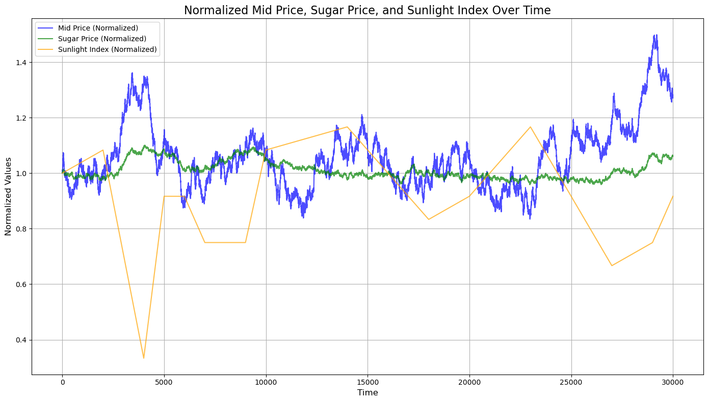

We identify the current trend of sunlight index and sugar price using the current value minus the previous value. If the sunlight index goes below 50:

- **Sunlight uptrend + sugar downtrend**: Sell signal  
- **Sunlight downtrend + sugar uptrend**: Buy signal

As all outstanding positions at the end of the day will be force-converted, this will potentially result in a huge loss if we do not unwind our positions earlier. Therefore, when the timestamp is greater than 999,000 (i.e., the last 10 timestamps of the day), the algorithm solely unwinds all positions either in the domestic or the foreign market, whichever is more favorable.
</details>

---
<details>
<summary><h2>Round 5: Counterparty Information</h2></summary>

The final round introduced no new products. Instead, we can now see the parties behind every trade in the market. We identified that Olivia was buying the dip and selling the tip in Squid Ink and Croissant. We implemented the strategy to follow Olivia's Squid Ink trades all-in if the signal is detected, and fall back to our original strategy otherwise. Effectively, we take the entire bid order book if a sell signal is detected, and take the entire ask order book if a buy signal is detected.

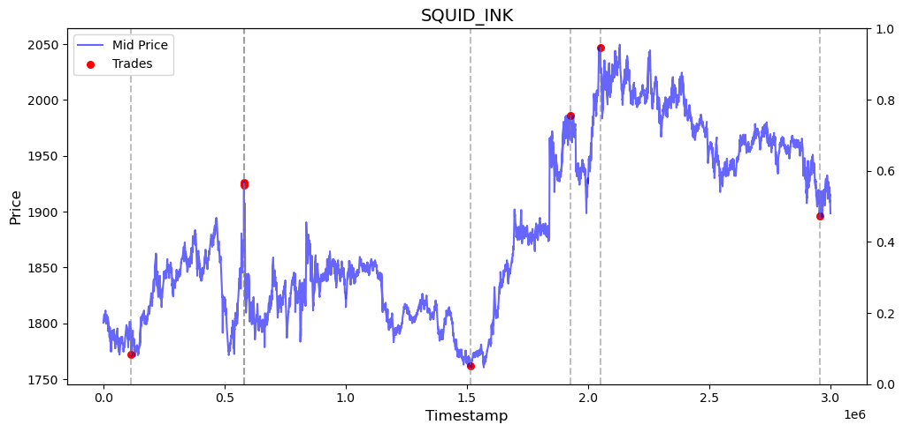
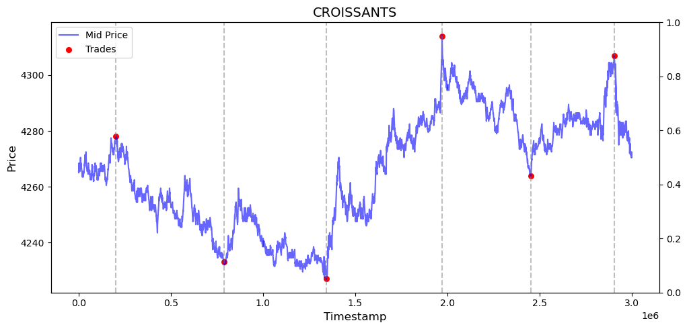
</details>

---

## 🔗 Useful Links
- **GitHub Repository**: [IMC Prosperity 3 Documentation](https://github.com/angus4718/imc-prosperity-3-public)  
- **Wiki**: [IMC Prosperity 3 Wiki](https://imc-prosperity.notion.site/Prosperity-3-Wiki-19ee8453a09380529731c4e6fb697ea4)  
- **2nd Place Solution**: [Frankfurt Hedgehogs](https://github.com/TimoDiehm/imc-prosperity-3)
- **7th Place Solution**: [CMU Physics](https://github.com/chrispyroberts/imc-prosperity-3)
- **Jasper's Backtester**: [IMC Prosperity 3 Backtester](https://github.com/jmerle/imc-prosperity-3-backtester)